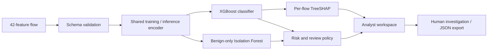

# NIDA — Network Intrusion Detection Agent

**Signal. Evidence. Action.** A network-flow investigation workspace that joins attack classification, anomaly detection, per-flow explanations, and an explicit analyst review policy.

[](https://github.com/rxp017/Network_intrusion_detection_agent/actions/workflows/ci.yml)

[Three-minute demo](docs/DEMO.md) · [Model card](docs/MODEL_CARD.md) · [Audit & verification](docs/AUDIT.md) · [Data provenance](docs/DATA_SOURCES.md)


## What you can demonstrate

- **Explain an individual verdict.** Native XGBoost TreeSHAP shows the signed feature contributions for the selected flow.
- **Manage the noise.** A review threshold chosen from validation normals reduces false alarms, with the recall tradeoff measured on held-out data.
- **Investigate interactively.** Pause/resume replay, select a scenario, filter the queue, inspect raw features, edit a JSON flow, and export a session.
- **Show the evidence.** Per-class metrics, confusion matrix, weak classes, source hashes, and a majority baseline are visible and reproducible.
- **Run without venue Wi-Fi.** Once dependencies are installed, inference, replay, charts, styles, and fonts work locally. The optional Swagger documentation uses a CDN.

**Scope:** This is a research prototype operating on UNSW-NB15 feature rows. The dashboard replays benchmark data; it does not capture packets, discover devices, or block traffic. An anomaly candidate is not a verified zero-day exploit.

## Run locally

**Tested runtime: CPython 3.14.7.** Use Python 3.14 with the pinned dependencies; the bundled scikit-learn artifacts depend on compatible versions.

### Windows

Double-click `run.bat`, or:

```powershell
py -3.14 -m venv .venv
.\.venv\Scripts\python.exe -m pip install -r requirements.txt
.\.venv\Scripts\python.exe main.py
```

### macOS / Linux

```bash
python3.14 -m venv .venv
.venv/bin/python -m pip install -r requirements.txt
.venv/bin/python main.py
```

Open **http://127.0.0.1:8000**. The trained models and 400-flow replay are included. No API keys, training step, database, or dataset download is needed to run the demo.

The server binds to loopback by default. `NIDA_HOST`, `NIDA_PORT`, and `NIDA_ARTIFACTS_DIR` override the bind address, port, and trusted artifact directory. Restart after replacing a model bundle. Do not expose the unauthenticated API publicly.

### Optional container

```bash
docker build -t nida .
docker run --rm -p 127.0.0.1:8000:8000 nida
```

The image runs as a non-root user. Docker was not available in the local verification environment; this recipe is provided but not claimed as tested.

## Measured results

Model `0013990bc956`, evaluated on **82,332 held-out flows**. Training uses the published 175,341-row split after duplicate cleanup; exact cross-split feature overlaps are removed from training.

| Measure | Result |
|---|---:|
| Multiclass accuracy | **72.89%** |
| Majority-class baseline | 44.94% |
| Macro F1 across 10 classes | 0.538 |
| Raw classifier attack recall | 98.86% |
| Raw classifier false-positive rate | 33.41% |
| **Review queue attack recall** | **89.42%** |
| **Review queue precision** | **96.04%** |
| **Review queue false-positive rate** | **4.52%** |
| Local inference including TreeSHAP, median / p95 | 30.7 / 35.1 ms |

The review queue is a separate policy, not an improved multiclass accuracy score. It prioritizes flows with `P(attack) >= 0.9418844` or an anomaly-candidate flag. The threshold is the 99th percentile of attack scores on validation normals. Its held-out false-positive rate is higher than the 1% calibration target: distribution shift remains visible.

Analysis and Backdoor recall are poor; Worms has only 44 test examples. Unqueued flows are not certified safe. The balanced replay is deliberately useful for demonstrating every class and is **never** used to calculate these benchmark metrics.

[Complete metrics](artifacts/evaluation.json) · [Independent recomputation and timing](verification/evaluation.json) · [Limitations](docs/MODEL_CARD.md)

## Architecture



### Risk and novelty

```text
attack_score = 1 - P(Normal)
anomaly_percentile = fraction of validation-normal scores >= this raw anomaly score
risk = round(60 × attack_score + 40 × anomaly_percentile)

anomaly_candidate = predicted Normal AND raw anomaly < validation-normal 1st percentile
review_recommended = attack_score >= review threshold OR anomaly_candidate
```

Risk tiers: low <25, medium <50, high <75, critical ≥75. These are prioritization heuristics, not calibrated probabilities of harm. Class scores, risk, and review decisions remain separate in the API.

TreeSHAP contributions explain the **predicted class's raw margin**. They are additive in margin space, not probability space; they do not establish causation. The UI shows the six strongest contributions and the original feature row.

## API

| Endpoint | Purpose |
|---|---|
| `GET /health` | Loaded model ID, classes, replay readiness |
| `GET /schema` | Required fields, numeric bounds, known categories |
| `GET /sample?category=Normal` | Labelled benchmark example, with inference features separated |
| `POST /predict` | One flow, scores, review decision, warnings, TreeSHAP |
| `POST /predict?explain=false` | Inference without TreeSHAP |
| `POST /predict/batch` | 1–100 flows; no per-flow TreeSHAP |
| `GET /metrics` | Full held-out metrics, confusion matrix, validation selection |
| `GET /limitations` | Weak classes and deployment limitations |
| `GET /explain/{class}` | Global feature gain; explicitly distinct from per-flow evidence |
| `WS /ws/stream` | Labelled replay; `category`, `interval` (0.1–3 s), `offset` |
| `GET /docs` | Interactive OpenAPI documentation |

A runnable example:

```python
import json
from urllib.request import Request, urlopen

sample = json.load(urlopen("http://127.0.0.1:8000/sample?category=Generic"))
request = Request(
    "http://127.0.0.1:8000/predict",
    data=json.dumps(sample["features"]).encode(),
    headers={"Content-Type": "application/json"},
)
result = json.load(urlopen(request))
print(result["predicted_attack_cat"], result["review_recommended"])
print(result["explanation"]["features"])
```

All 42 features are required. Numeric features must be finite numbers between 0 and 1e15; numeric strings, booleans, nulls, and negative values are rejected. Unknown field names fail validation. Unseen protocol/service/state categories are accepted with a visible all-zero encoding warning. `id`, `label`, and `attack_cat` are ignored metadata and cannot influence predictions.

Bodies are limited to 256 KiB. Replay allows eight concurrent clients per process; inference is dispatched off the event loop through four worker slots. These bounds are safeguards, not a production capacity guarantee.

## Reproduce training and evaluation

```bash
python scripts/download_data.py
python train.py
python scripts/verify_evaluation.py
```

Use the virtual environment's Python, or activate it first.

1. Download the pinned mirror revision and verify both CSV SHA-256 hashes.
2. Map the reversed mirror filenames to the publisher's documented split sizes.
3. Remove 10,279 training rows whose features occur in the test split; then remove 65,324 within-training duplicate feature rows.
4. Stratify the remaining 99,738 rows into 79,790 fit and 19,948 validation/calibration rows (seed 42).
5. Fit the encoder and models on the fit partition. Compare two fixed weighting choices using **validation macro F1**.
6. Set anomaly and review thresholds on validation normals. Report final results on the original held-out test split.
7. Save a hash-checked model bundle and a deterministic 40-per-class replay.

The full CSVs stay in ignored `data/raw/`. The included replay is a balanced benchmark sample. `generate_sample_data.py` creates explicitly synthetic, randomly labelled **negative-control fixtures** in `data/synthetic/`; it cannot overwrite the benchmark files and is not used by training.

## Verification

```bash
python -m pip install -r requirements-dev.txt
python -m pip check
ruff check .
ruff format --check .
node --check static/dashboard.js
python -m pytest -m "not browser" -q
python -m playwright install chromium
```

Browser tests (isolated server, Chromium, desktop and 390 px mobile):

```powershell
$env:NIDA_BROWSER_TESTS = "1"
python -m pytest -m browser -q
```

On macOS/Linux: `NIDA_BROWSER_TESTS=1 python -m pytest -m browser -q`.

The suite checks strict validation, label isolation, training/serving encoding consistency, TreeSHAP additivity, artifact corruption, stream resume/origin checks, queue policy, offline dashboard operation, keyboard interaction, export, and injection-safe rendering. CI repeats lint, API/model tests, and Chromium tests on Linux; see the badge for its actual status.

## Repository map

```text
main.py                    FastAPI boundary, REST, replay WebSocket
model.py                   Shared encoder, artifact integrity, inference, TreeSHAP
train.py                   Deterministic fitting, calibration, benchmark reports
static/ + dashboard.html   Local, dependency-free analyst workspace
artifacts/                 Trained models, manifest, evaluation and model metadata
data/replay.csv            400 labelled held-out examples; provenance in replay.json
scripts/                   Pinned dataset fetcher and independent verification
tests/                     Model, API, WebSocket and browser checks
docs/                      Model card, demo script, audit, source attribution
verification/              Recomputed metrics and local timing evidence
```

## Dataset credit

UNSW-NB15 was created by Nour Moustafa and Jill Slay at UNSW Canberra. Dataset rights remain with the authors. Academic research use and citation requirements are described on the [official dataset page](https://research.unsw.edu.au/projects/unsw-nb15-dataset); commercial use requires agreement with its authors. See [full provenance and citations](docs/DATA_SOURCES.md).

NIDA makes no claim of production readiness, previously unseen exploit detection, or guaranteed hackathon placement.
