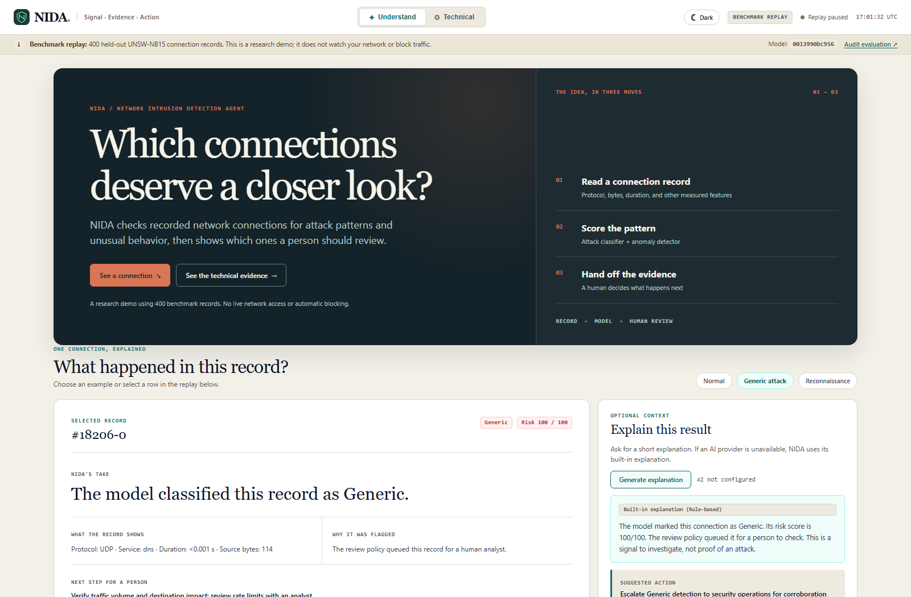
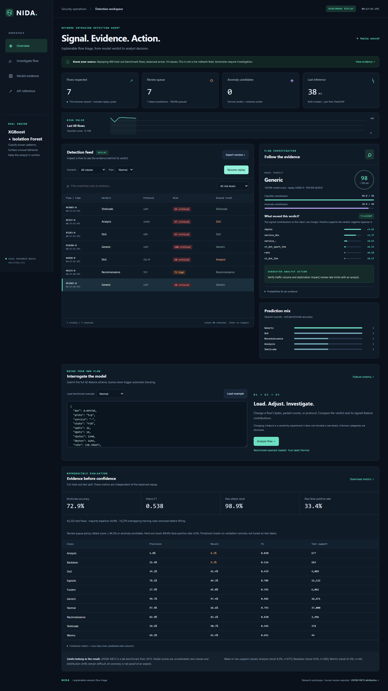
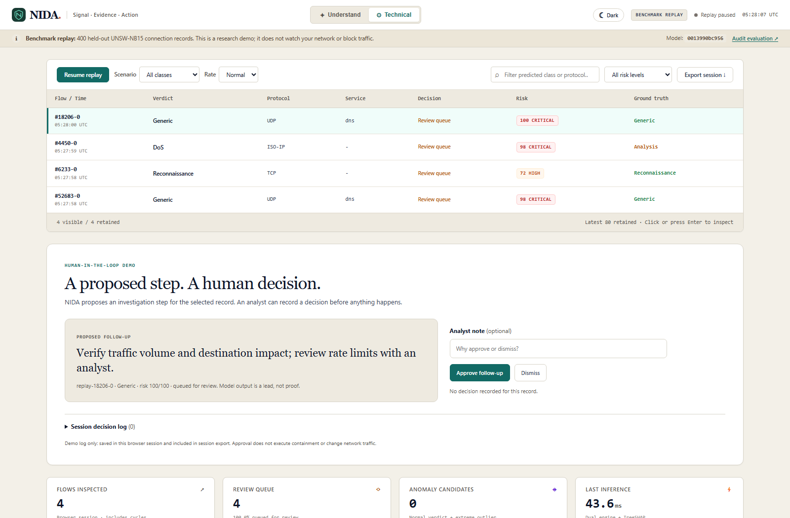

# NIDA: screenshot walkthrough and judge answers

**Say this first:** “NIDA is a research demo that replays saved network-connection summaries. It uses a classifier to suggest a traffic category, an anomaly detector to spot unusual Normal-looking records, and a separate policy to queue some records for human review. It shows the evidence behind each result. It does not monitor or block a live network.”

## Before clicking

Run `python main.py` and open `http://127.0.0.1:8000`. The loading screen means the browser is waiting for the model, benchmark results, and first connection. It leaves when the app is ready or shows an error if startup fails. No API key is needed. **Understand** is the simpler view; **Technical** exposes the evidence. The theme switch remembers light/dark choice. The selected record remains selected when changing modes.

The 400-record replay contains **40 held-out examples from each of 10 ground-truth classes**, chosen for demonstration and shuffled. It is deliberately balanced and cycles after 400; it is **not** a live sample or the source of the published accuracy numbers. Those numbers come from the separate 82,332-row held-out test split. [Data source and replay construction](DATA_SOURCES.md).

## Screenshot 1 — Understand

[Click to open the full-size Understand screenshot](images/understand_desktop.png) · [dark theme](images/understand_dark.png) · [mobile](images/understand_mobile.png)

Read the screenshot from top to bottom:

| On screen | What to say simply |
|---|---|
| **NIDA / Understand / Technical** | NIDA stands for Network Intrusion Detection Agent. Understand explains the result in plain language. Technical shows model details and evaluation. Both use the same result. |
| **Light/dark button** | A display preference saved in this browser; it does not change inference. |
| **Benchmark replay / connection status / UTC clock** | These tell you this is a local replay, whether the stream is running, and the current UTC time. “Replay paused” means no new rows are being streamed. The displayed row time is when it was replayed, not the original network capture time. |
| **Research boundary notice and model ID** | The 400 rows are saved UNSW-NB15 benchmark records. The model ID identifies the loaded artifact bundle. NIDA does not watch this computer’s traffic or block connections. “Audit evaluation” jumps to the measured results. |
| **“Which connections deserve a closer look?”** | The actual problem: large numbers of records need triage, and a human needs a reason to inspect one. NIDA helps prioritize and explain; it does not decide guilt. |
| **Record → model → human review** | A record holds measured features such as protocol, service, duration and bytes. Two models score it. A review policy may queue it. A person verifies context and decides what to do. |
| **See a connection / See the technical evidence** | The first button moves to the selected-record explanation. The second changes to Technical mode. |
| **Normal / Generic attack / Reconnaissance** | Example selectors. These are benchmark class names, not buttons that generate network attacks. A category is the dataset’s label; the model can disagree with it. |
| **Selected record and ID** | One replay item or manually scored sample. The numeric ID identifies a benchmark row; the suffix identifies its replay cycle. It is not an IP address or incident number. |
| **Verdict and risk badge** | Verdict is the classifier’s predicted category. Risk is a 0–100 *heuristic priority score*, not a 100% chance of an attack. The badge’s low/medium/high/critical tier is a display bucket. |
| **What the record shows** | Values are read from this selected record. Protocol is the network protocol; service is the benchmark’s service field; duration and source bytes are measured features. A dash means no service value was supplied. |
| **Why it was flagged** | Explains whether the separate review policy queued the record. A predicted attack category and review-queue membership are different questions. |
| **Next step for a person** | A suggested check, such as reviewing volume or logs. It is advice, not an automatic firewall action. |
| **Generate explanation** | Optional prose. With no configured Groq/Gemini provider, it says **AI not configured** and shows a deterministic built-in explanation. If a provider fails, the built-in explanation is still available. The prose describes the model’s result; it is not a second detector. |
| **What do these terms mean?** | Expandable glossary. It stays closed until needed so the first screen remains readable. |

**If a judge points at “Generic”:** It is the UNSW-NB15 class name. Do not call it “high-volume flooding”; that would confuse it with DoS. **If the model verdict differs from Ground truth:** that is a visible error, not a broken interface. Use it to explain why benchmark accuracy is below 100%.

## Screenshot 2 — Replay table and controls

[Click to open the full-size replay screenshot](images/dashboard.png) · [mobile screenshot](images/mobile.png)

- **Pause / Resume** stops or restarts the WebSocket replay. The browser keeps its offset, so resuming continues from the next record. The replay loops after the 400th record.
- **Scenario** asks the server for rows of a chosen **ground-truth** benchmark class. It does not guarantee that the model predicts that class.
- **Rate** changes the interval between records: Slow 1.5 seconds, Normal 0.6 seconds, Fast 0.15 seconds.
- **Search** filters the retained rows by predicted class, protocol, service, true label, or record ID. **Risk filter** can show all, review-queue only, score ≥50, or score ≥75. These filters change what is visible in the browser; they do not retrain the model.
- **Export session** downloads `nida-session.json` with the browser session totals, predicted-class counts, and latest 80 retained rows. Those rows include model outputs, evidence, replay timestamps, and dataset labels. It does **not** export all 82,332 test rows or artifact-file hashes.
- **Flow/Time** is the replay ID and replay time. **Verdict** is model output. **Protocol/Service** are input features. **Decision** says Review queue or Routine. **Risk** is the heuristic score/tier. **Ground truth** is the benchmark label used to check correctness.
- Click a row, or focus it and press Enter/Space, to inspect it. A highlighted row is selected. “Latest 80 retained” limits browser memory; counters can include more rows and repeated cycles.
- On a phone, the wide table scrolls sideways to preserve all columns; the rest of the page stays within the screen.

**Important distinction:** A risk score, a category prediction, an anomaly flag, a review-queue decision, and a ground-truth label are five different things.

## Screenshot 3 — Technical mode

[Click to open the full-size Technical screenshot](images/technical_desktop.png) · [mobile](images/technical_mobile.png)

The shared replay table remains at the top. The rest of Technical mode continues below this screenshot:

| Section | What it means |
|---|---|
| **Flows inspected** | Count processed in this browser session; cycles can repeat records. It is not the 82,332-row evaluation size. |
| **Review queue** | Session records selected by the separate policy. It is not simply the number predicted as attacks. |
| **Anomaly candidates** | Records predicted Normal but unusually different from normal examples by the Isolation Forest cutoff. Anomaly does not prove a new exploit. |
| **Last inference** | Server-side model scoring time for the latest row. It does not include browser rendering, network delay, or total throughput. |
| **Risk pulse / prediction mix** | Recent browser-session risk scores and predicted-class counts. They help inspect the current replay; they are not population statistics or model accuracy. |
| **Classifier verdict / confidence** | The highest-scoring of 10 classes and that class’s model score. “100%” can be rounding; these scores are not calibrated probabilities or guarantees of truth. |
| **True class: Match/Mismatch** | The dataset label compared with the prediction. It is available because this is a labelled benchmark replay. A custom row has no trustworthy ground truth unless supplied separately. |
| **Heuristic risk and two bars** | `round(60 × (1 − P(Normal)) + 40 × anomaly_percentile)`. The first part uses all non-Normal class score mass; the second ranks abnormality against saved normal examples. 100/100 means highest triage priority under this formula, not certain harm. |
| **Review threshold 0.9419** | Queue if the non-Normal score is at least 0.9418844, **or** it is an anomaly candidate. This threshold was chosen using validation normal records; the held-out test checks its actual behavior. A high risk tier and queue membership need not be identical. |
| **Raw anomaly score / percentile** | Isolation Forest outputs a raw normality score; lower can be more unusual. NIDA converts it to a rank against normal reference scores for the risk formula. The normal cutoff is about −0.0836. |
| **TreeSHAP bars** | Feature contributions to the predicted class’s raw model margin. Positive raises that class’s margin; negative lowers it. They explain model arithmetic, not real-world causation, and do not prove a connection is malicious. |
| **Suggested action / warnings** | A category-based investigation suggestion plus cautions, including weak classes or unseen categorical values. An unseen value is encoded as all zero and disclosed. |
| **Raw probabilities & feature dump** | Expand for all class scores and the scored record. The graph shows only the six strongest absolute feature contributions, while the raw result retains the data needed to inspect the full response. |
| **Interrogate the model** | Load one labelled example, optionally edit its complete 42-feature JSON row, then click Analyze flow. This is a *sensitivity experiment*, not a simulation of a real attack. A changed feature can move a score in either direction. Missing/invalid fields are rejected with HTTP 422. |
| **Evidence before confidence** | Metrics calculated from the 82,332 held-out test rows, independent of the 400 balanced demo rows. Per-class precision/recall/F1/support and the confusion matrix reveal where the model is wrong. |
| **Confusion matrix** | Rows are true benchmark classes; columns are predictions. Diagonal cells are correct, off-diagonal cells are mistakes. |
| **Known weak classes / provenance** | Analysis recall 8.27%, Backdoor 9.26%; Worms has only 44 test rows. These are explicit limitations, not hidden by the overall accuracy. |

### The numbers judges may ask for

| Measure | Value | Simple meaning |
|---|---:|---|
| 10-class accuracy | 72.89% | Correct category on roughly 73 in 100 held-out rows. |
| Majority-class baseline | 44.94% | Always choosing the most common class would get roughly 45 in 100. |
| Macro F1 | 0.538 | Class-balanced summary; weak rare classes pull it down. |
| Raw attack recall | 98.86% | Before queue filtering, it labels most attack rows as non-Normal. |
| Raw false-positive rate | 33.41% | Before queue filtering, many Normal rows are incorrectly flagged. |
| Review-queue attack recall | 89.42% | The queue catches roughly 89 in 100 labelled attack rows, so about 11 in 100 are missed. |
| Review-queue precision | 96.04% | Among queued rows in this test split, roughly 96 in 100 carry attack labels. Real-world precision can differ if attacks are rarer. |
| Review-queue false-positive rate | 4.52% | Roughly 4.5 in 100 held-out Normal rows are queued. |

These values are from [the saved evaluation](../artifacts/evaluation.json) and the [model card](MODEL_CARD.md). The test split was seen during development; it is **not** an independent external deployment study.

## A safe three-minute click path

1. **Start in Understand.** Say the one-sentence pitch. Point to “benchmark replay” and say what the system does *not* do.
2. **Choose Generic attack.** Read the selected record’s verdict, observed features, review decision and human action. Do not assume every example predicts its ground-truth class correctly.
3. **Click Generate explanation.** With no API key, say “This is the built-in rule-based explanation; external AI is optional.” Do not call it a live AI answer.
4. **Click Technical.** Show that the selected record stays selected. Explain risk as priority, confidence as an uncalibrated model score, and the ground-truth comparison as the benchmark check.
5. **Scroll to TreeSHAP and Evidence before confidence.** Point to one positive/negative contribution, then 72.89% accuracy and the weak classes. End with “a person still decides what to investigate.”
6. **If time remains:** load a benchmark example into the JSON workbench, click Analyze flow, then remove a required field to show validation. Avoid predicting how any one edited feature will change the result.

## Small questions that can catch you out

**Is it live traffic?** No. It replays precomputed UNSW-NB15 feature rows. There is no packet sniffer or network adapter.

**Why 400 here and 82,332 in the metrics?** The 400 rows make every class visible in a balanced demo. The 82,332 held-out rows are the evaluation set. Never use the 400-row screen to claim accuracy.

**What is a flow?** One summarized network conversation represented by 42 model input features, not a full packet recording.

**Where did the data come from?** A pinned public mirror of the UNSW-NB15 benchmark; the publisher’s original download required sign-in during the audit. The mirror files were identified by their documented row counts and checked by hash. This is not publisher authentication. [Provenance](DATA_SOURCES.md).

**Are the labels always correct?** They are the benchmark’s supplied labels. Label ambiguity and duplicates remain limitations. The screen exposes prediction/label mismatches.

**What is Normal?** A classifier category, not a certificate that a connection is harmless.

**Why can “Normal” still be queued?** The anomaly detector can flag an unusual Normal-predicted row; the review policy includes anomaly candidates.

**Does a critical risk badge mean it was queued?** Not necessarily. Risk tier and review policy are separate calculations.

**What does 100% model confidence mean?** The classifier strongly favored one class; it can be wrong, and the scores are not calibrated guarantees.

**Is 100 risk a 100% attack probability?** No. It is a rounded, weighted priority score.

**What is a false positive?** A truly Normal benchmark row that the model or queue incorrectly flags.

**What is recall?** Of the labelled attacks, the fraction caught. Queue recall below 100% means some attacks are missed.

**Why can precision change in deployment?** The test split’s attack/Normal mix may differ from another network. Precision depends on prevalence.

**Does “AI not configured” mean NIDA failed?** No. Detection, anomaly scoring, SHAP and the built-in explanation work offline. Only optional external prose is unavailable.

**Does external AI decide the verdict?** No. The model scores first. An optional provider receives a prompt containing the verdict, scores, review flag and selected feature contributions to write prose. It may be wrong, so inspect the evidence.

**Are keys exposed in the browser?** They are read on the server from local configuration. Never put keys in the JSON workbench or commit `.env`. When optional cloud narration is enabled, selected evidence is sent to that provider.

**Does TreeSHAP prove a feature caused an attack?** No. It explains how a feature moved a model margin for this prediction.

**Can it detect zero-days or stop an attacker?** No. An unusual record is an investigation lead. NIDA has no live capture, device discovery, firewall control, or automatic containment.

**Why is a record timestamp current?** The stream stamps it when replaying. It is not the original capture time.

**Why does the same row return later?** The stream cycles through the 400-record demo. Session totals can count repeated cycles.

**Is the exported file a permanent incident log?** No. It is a browser-generated session snapshot. There is no durable incident database.

**What is the biggest weakness?** The older benchmark and very weak Analysis/Backdoor recall. A contemporary independent dataset and live feature extractor are needed before operational claims.
